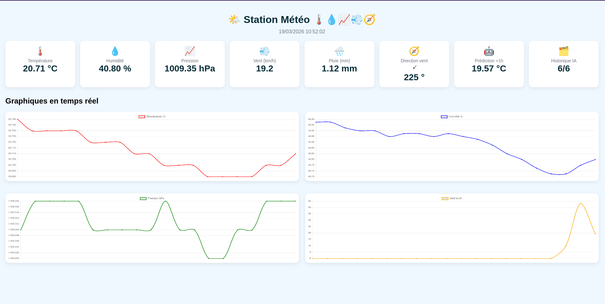
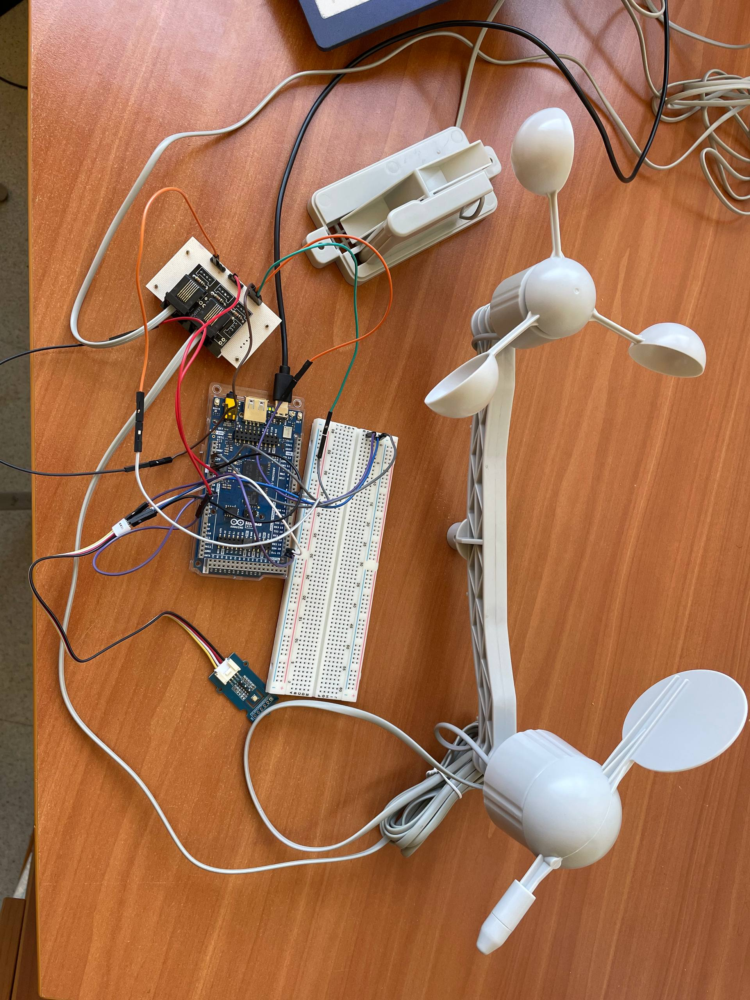

# Embedded AI Weather Station


An end-to-end embedded weather station built on **Arduino GIGA R1 WiFi**, combining **real-time environmental sensing**, **on-device machine learning inference** for **+1 hour temperature forecasting**, and a lightweight **embedded web dashboard** for live monitoring.

---

## Overview

This project was developed to demonstrate a complete embedded AI pipeline, from **data preparation and model design** to **deployment on a microcontroller**.

The system is capable of:

- acquiring real-time environmental data from multiple sensors,
- estimating wind speed, wind direction, and rainfall,
- running a fully local AI inference pipeline on the embedded target,
- predicting the **next-hour temperature**,
- exposing live measurements through a **WiFi-hosted dashboard** and a **JSON API endpoint**.

Beyond a simple weather station, this project was designed as a full embedded intelligent system integrating:

- hardware interfacing,
- signal acquisition,
- non-blocking firmware scheduling,
- machine learning preprocessing,
- TensorFlow Lite conversion,
- embedded inference,
- and lightweight web visualization.

---

## Project Preview

### Embedded web dashboard


### Hardware prototype


---

## Key Features

- **Arduino GIGA R1 WiFi** as the main embedded platform
- **BME680** environmental sensing for:
  - temperature
  - humidity
  - pressure
  - gas resistance
- Weather meter kit integration for:
  - **anemometer**
  - **wind vane**
  - **tipping bucket rain gauge**
- **Embedded web server** providing:
  - a live dashboard
  - real-time charts
  - a JSON API endpoint
- **On-device AI inference**
- **+1 hour temperature prediction**
- Complete pipeline from:
  - training notebook
  - model export
  - TensorFlow Lite conversion
  - C header generation
  - deployment on Arduino

---

## System Architecture

The project is structured as a complete embedded AI pipeline:

### 1. Sensor acquisition
- BME680 over I2C for environmental measurements
- wind and rain sensors handled through digital interrupts and analog reading

### 2. Signal processing
- pulse counting for wind speed
- resistance-based lookup for wind direction
- tipping bucket accumulation for rainfall

### 3. Historical feature construction
- sliding window built from the last **6 measurement steps**
- features extracted from:
  - temperature
  - humidity
  - pressure

### 4. Time feature encoding
- cyclic encoding of:
  - hour
  - month
- implemented using sine/cosine representation

### 5. Embedded AI inference
- normalized feature vector generation
- local TensorFlow Lite inference using **ArduTFLite**
- prediction of **temperature at t+1 hour**

### 6. Data serving
- JSON endpoint available at `/data`
- HTML dashboard available at `/`

---

## Hardware Stack

### Main board
- **Arduino GIGA R1 WiFi**

### Sensors
- **BME680** environmental sensor
- Weather meter kit including:
  - **cup anemometer**
  - **wind vane**
  - **tipping bucket rain gauge**

### Measured Variables
- temperature
- humidity
- pressure
- gas resistance
- wind speed
- wind direction
- rainfall

---

## Machine Learning Pipeline

The AI workflow was first developed and validated offline in Jupyter notebooks, then exported to the embedded target.

### Dataset
The model was trained using the **Guangzhou subset** of the **PM2.5 Data of Five Chinese Cities** dataset from the **UCI Machine Learning Repository**.

### Prediction Target
The embedded model predicts:

- **temperature at t+1 hour**

### Selected Input Variables
Only the variables most relevant to the embedded use case were retained:

- **TEMP**
- **HUMI**
- **PRES**

### Feature Engineering
A supervised learning dataset was built using a **6-step sliding window**.

The final input vector contains **22 features**:

- **18 historical features**
  - 6 temperature values
  - 6 humidity values
  - 6 pressure values
- **4 time features**
  - hour_sin
  - hour_cos
  - month_sin
  - month_cos

### Preprocessing
- chronological sorting by timestamp
- removal of missing values
- feature standardization using **StandardScaler**
- chronological train / validation / test split:
  - **70% train**
  - **15% validation**
  - **15% test**

### Model Architecture
A compact **MLP** was selected for embedded deployment:

- input: **22 features**
- hidden layer 1: **Dense(32, ReLU)**
- hidden layer 2: **Dense(16, ReLU)**
- output: **Dense(1)**

### Training Strategy
- optimizer: **Adam**
- loss: **MSE**
- metric: **MAE**
- **EarlyStopping** with best weights restoration

---

## Model Conversion and Embedded Deployment

After training, the Keras model was converted to **TensorFlow Lite** and then exported as a C header for microcontroller integration.

### Deployment Workflow
1. Train the model in TensorFlow / Keras
2. Export the trained `.keras` model
3. Convert it to `.tflite`
4. Convert the `.tflite` file into `model_data.h`
5. Load the model in the Arduino firmware using **ArduTFLite**
6. Run inference directly on the board

This workflow enables **fully local prediction**, without any cloud dependency.

---

## Results

### Test Performance
The trained MLP achieved:

- **Test MAE:** `0.4257 °C`
- **Test RMSE:** `0.6706 °C`

### Baseline Comparison
A naive persistence baseline using the current temperature as the next-hour prediction achieved:

- **Baseline MAE:** `0.6274 °C`
- **Baseline RMSE:** `0.9465 °C`

The MLP therefore provides a clear improvement over a simple baseline.

### Functional Prototype Results
The embedded prototype successfully demonstrates:

- real-time acquisition of environmental data
- wind and rain event counting
- live web dashboard visualization
- on-device AI prediction
- end-to-end integration between sensing, inference, and web serving

---

## Embedded Firmware Highlights

The firmware includes:

- non-blocking task scheduling using `millis()`
- interrupt-based wind and rain counting
- BME680 acquisition over I2C
- wind direction estimation through resistance lookup
- AI history buffer construction
- on-device feature normalization
- embedded TensorFlow Lite inference
- JSON serialization for web communication
- direct generation of HTML + Chart.js dashboard content from firmware

---

## Web Interface

The board hosts a lightweight web interface displaying:

- temperature
- humidity
- pressure
- wind speed
- rainfall
- wind direction
- AI prediction at +1 hour
- AI history buffer status

The dashboard also includes real-time charts for:

- temperature
- humidity
- pressure
- wind speed

---

## Repository Structure

```text
embedded-ai-weather-station/
├── README.md
├── LICENSE
├── .gitignore
├── docs/
│   └── images/
│       ├── dashboard-web-interface.png
│       ├── serial-monitor-startup.png
│       ├── hardware-setup-close.jpg
│       └── hardware-setup-full.jpg
├── hardware/
│   └── sensors/
│       └── weather-meter-kit-datasheet.pdf
├── software/
│   ├── arduino/
│   │   └── weather_station_giga/
│   │       ├── weather_station_giga.ino
│   │       └── model_data.h
│   └── ai/
│       ├── training/
│       │   └── weather_prediction_training.ipynb
│       ├── conversion/
│       │   └── tf_to_tflite.ipynb
│       └── exported-model/
│           └── weather_prediction_model.tflite
└── results/
    └── demo-video/
        └── demo.mp4
```

---

## Getting Started

### 1. Hardware setup

Connect:

- the **BME680** to the Arduino GIGA R1 WiFi through I2C,
- the weather meter kit sensors to the corresponding analog/digital pins used in the firmware.

### 2. Install Arduino dependencies

Install the required libraries:

- `Adafruit_BME680`
- `Adafruit_Sensor`
- `ArduTFLite`

### 3. Configure WiFi

In the Arduino sketch, replace the placeholder credentials with your local WiFi settings:

```cpp
char ssid[] = "YOUR_WIFI_SSID";
char pass[] = "YOUR_WIFI_PASSWORD";
```

### 4. Upload the firmware

Open the Arduino project and upload the firmware to the **Arduino GIGA R1 WiFi**.

### 5. Access the dashboard

Once the board is connected to WiFi, open its IP address in your browser.

---

## Prototype Notes

This repository reflects a **working prototype** and documents the current engineering trade-offs.

### Current Prototype Assumptions

- `HISTORY_INTERVAL_MS = 10000UL` is used for **demonstration purposes**
  - this accelerates validation of the AI pipeline
  - in a real hourly deployment, this interval should be set to **1 hour**
- `CURRENT_HOUR` and `CURRENT_MONTH` are **manually fixed**
  - future versions should retrieve real time from **RTC** or **NTP**
- the current setup is a **bench prototype**
  - it is not yet an outdoor ruggedized system
- WiFi credentials are intentionally left as placeholders in the public repository

This section is intentionally transparent: the goal of this repository is to present both the **validated functionalities** and the **next engineering steps**.

---

## Future Improvements

Planned next steps include:

- replacing fixed time features with real-time clock or NTP synchronization
- using true hourly historical sampling in deployment mode
- improving enclosure and field robustness
- adding persistent local storage for measurements
- extending prediction targets to additional weather variables
- evaluating lightweight recurrent or temporal models for comparison
- improving calibration and long-term outdoor reliability

---

## Why This Project Matters

This project showcases the design and integration of a complete embedded intelligent system combining:

- sensor interfacing
- microcontroller firmware development
- real-time data acquisition
- web-based embedded visualization
- machine learning preprocessing
- model deployment on constrained hardware
- end-to-end embedded AI engineering

It is intended as a portfolio project for roles in **embedded systems**, **edge AI**, and **intelligent connected devices**.

---

## Author

**Racim Caid**  
Master’s student in **Complex Systems Engineering**  
Focused on **embedded systems**, **edge AI**, and intelligent electronic systems.

---

## Credits

- **UCI Machine Learning Repository** — *PM2.5 Data of Five Chinese Cities*
- **Arduino**
- **Adafruit**
- **TensorFlow / TensorFlow Lite**
- Weather meter kit datasheet included in this repository

---

## License

This project is distributed under the **MIT License**.
